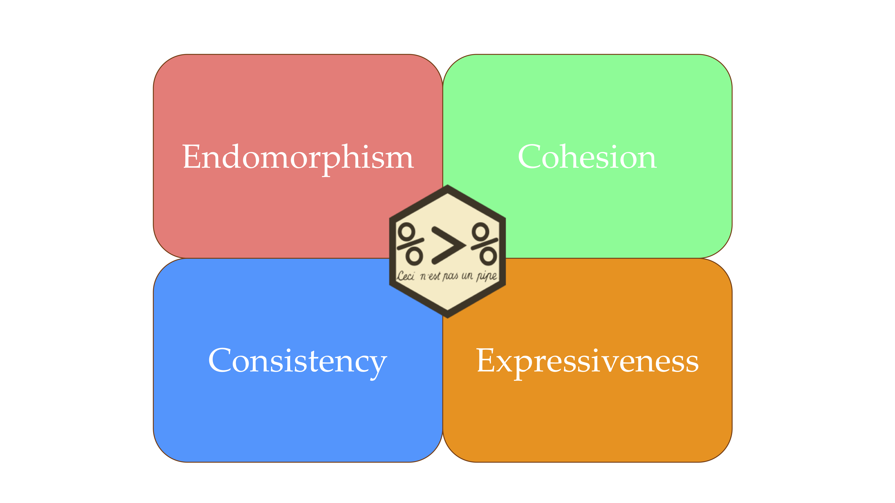

```{r setup, include=FALSE}
options(htmltools.dir.version = FALSE)
knitr::opts_chunk$set(comment = "")
library(plyranges)
dir <- system.file(package = "HelloRangesData", "extdata/")
genome <- as_granges(read.delim(file.path(dir, "hg19.genome"), 
                     header = FALSE),
                     seqnames = V1, start = 1L, width = V2)

gwas <- read_bed(file.path(dir, "gwas.bed"), genome_info = genome)
exons <- read_bed(file.path(dir, "exons.bed"), genome_info = genome) %>% 
  mutate(tx_id = sub("_exon.*", "", name))

```

class: center
# Bioconductor infrastructure is powerful...

<div style = "display:block; margin-left:auto; margin-right:auto">
  
  
  
</div>

.large[
Bioconductor abstractions enable **developing** software for biology!
]

---

# ... however

```{r}
pkgs_to_get_started <- c("S4Vectors", "IRanges", "GenomicRanges")
pkg_classes <- function(.) methods::getClasses(asNamespace(.))

n_classes <- pkgs_to_get_started %>% 
  lapply(pkg_classes) %>% 
  lengths() %>% 
  sum()
n_classes

n_methods <- length(methods(class = "Ranges"))
n_methods
```

.large[A lot is expected of an R beginner to **analyse** data with Bioconductor]

---
class: inverse, center, middle

# How far can a user get with just a GRanges?

---

# GRanges are tidy!

```{r, fig.align='center', echo=FALSE}
knitr::include_graphics("GRanges.png")
```

---

# Design a grammar


```{r, echo = FALSE, fig.align = "center", out.width="1080"}



```

---

# Include genomic semantics

.large[

- **arithmetic**: mutating/shifting/re-sizing/flanking/coverage
- **restriction**: filtering by metadata or ranges
- **aggregation**: summarizing over groups/overlaps/unions
- **merging**: combining ranges based on overlaps/nearest neighbors


_Biorxiv 327841_
]

---
# Changing coordinates

.large[ The start, end, and width of a GRanges of are mutually dependent.

How can we express changes to width with respect to ranges?]

```{r}
exons %>% 
  mutate(width = 2 * width)
```
---

## Anchoring operator

An anchor decorates a GRanges and changes downstream behaviour: 

```{r}
exons %>% 
  anchor_center() %>% 
  mutate(width = 2*width)
```

---
## Functions are explicit about genomic features and their intentions

```{r, eval = FALSE}
exons %>% 
  flank_downstream(2L)
exons %>% 
  anchor_3p() %>% 
  mutate(width = 2*width)
exons %>% 
  shift_upstream(10L)
```

---

# Merging many GRanges

.large[
- Reimagine overlap/nearest neighbour operations as table joins
- Carry over metadata
- Flatten API via function calls
]

```{r, eval = FALSE}
join_overlap_inner(a, b)
join_overlap_inner_within(a, b)
join_overlap_inner_directed(a, b)
```

---

# Overlap Joins

```{r, echo = FALSE, fig.align='center'}

```

---

## Composing workflows requires endomorphism

```{r}
cvg_summary <- exons %>%
  compute_coverage() %>% 
  filter(score > 0) %>% 
  group_by(seqnames) %>% 
  summarise(score = mean(score))

cvg_summary
```

---

# Summary

.large[

- GRanges are tidy!!!

- A cognitive framework for playing with GRanges

- A stepping stone from tidyverse to Bioconductor

- Learn more at workshop today at 4pm in VC206
]

---

# Acknowledgements

- **Michael Lawrence**
- **Di Cook**
- Matt Ritchie
- Charity Law
- Shian Su
- Earo Wang

Development: https://github.com/sa-lee/plyranges

Docs: https://sa-lee.github.io/plyranges/

Contributions/feedback welcome from the Bioconductor community!
