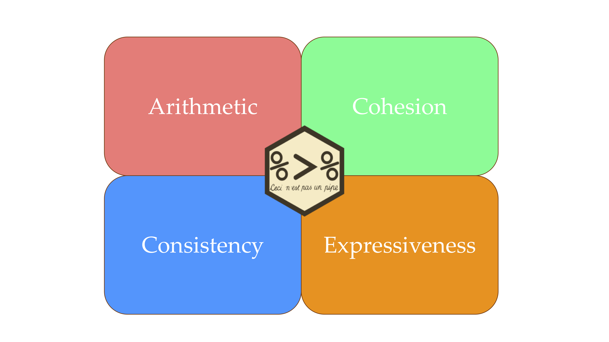

```{r setup, include=FALSE}
options(htmltools.dir.version = FALSE)
knitr::opts_chunk$set(comment = "")
library(plyranges)
```

class: center
# Bioconductor infrastructure is powerful...

<div style = "display:block; margin-left:auto; margin-right:auto">
  
  
  
</div>
---

# ...but the learning curve is steep!

```{r}
pkgs_to_get_started <- c("S4Vectors", "IRanges", "GenomicRanges")
pkg_classes <- function(.) methods::getClasses(asNamespace(.))

n_classes <- pkgs_to_get_started %>% 
  lapply(pkg_classes) %>% 
  lengths() %>% 
  sum()
n_classes

n_methods <- length(methods(class = "Ranges"))
n_methods
```

---
class: inverse, center, middle

# How far can a user get with just a GRanges?


---

# GRanges are tidy!

```{r, fig.align='center', echo=FALSE}
knitr::include_graphics("GRanges.png")
```

---

# Design a grammar


```{r, echo = FALSE, fig.align = "center", out.width="1080"}



```

---

# Include genomic semantics

.large[

- **arithmetic**: mutating/shifting/re-sizing/flanking
- **restriction**: filtering by metadata or ranges
- **aggregation**: summarizing over groups/overlaps/unions
- **merging**: combining ranges based on overlaps/nearest neighbors

]

See also: https://bit.ly/2v61UVs
---

# Finding introns in a non-model organism

.large[I have a GFF file from a non-model organism 😑.

How can I find introns?]
 
---

## Reading in the GFF

```{r}
gff_rngs <- read_gff("my.gff")

gff_rngs %>% 
  select(ID, type) %>% 
  head(3)
```

---

## Retrieve exons and extract IDs

```{r}
all_exons <- gff_rngs %>% 
  filter(type == "exon") %>% 
  mutate(exon_rank = sub("(.*)-([^-]+$)", "\\2", ID),
         gene_id = gsub("exon_|-[^-]+$", "", ID),
         exon_id = paste0(gene_id, ".", exon_rank)) %>% 
  select(gene_id, exon_id, exon_rank) 

all_exons %>% 
  head(3)
```

---

## For each gene, merge overlapping exons

```{r}
sub_exons <- all_exons %>% 
  group_by(gene_id) %>%
  # this will merge overlapping exons for each group
  reduce_ranges_directed()

sub_exons %>% 
  head(3)
```
---

## Get the ranges for each gene from the exons

```{r}
genes <- all_exons %>% 
  group_by(seqnames, strand, gene_id) %>% 
  summarise(start = min(start), end = max(end)) %>% 
  as_granges()

# other, simpler way
# genes <- gff_rngs %>% filter(type == "gene")

genes %>% 
  head(3)
```

---

## Combine the genes and exon ranges, and group by gene

```{r}
introns <- genes %>% 
  bind_ranges(sub_exons) %>% 
  group_by(gene_id)

introns
```

---

## Disjoin over each genes interval and filter

```{r}
introns <- introns %>% 
  disjoin_ranges_directed() %>% 
  filter_by_non_overlaps(sub_exons)

introns 
```

---

# Summary

.large[

- GRanges are tidy!!!

- A cognitive framework for playing with GRanges

- a stepping stone from tidyverse to biocverse 

]

---

# Acknowledgements

- **Michael Lawrence**
- **Di Cook**
- Matt Ritchie
- Charity Law
- Shian Su
- Earo Wang

.large[
Development: https://github.com/sa-lee/plyranges

Contributions/feedback from the Bioconductor community!
]